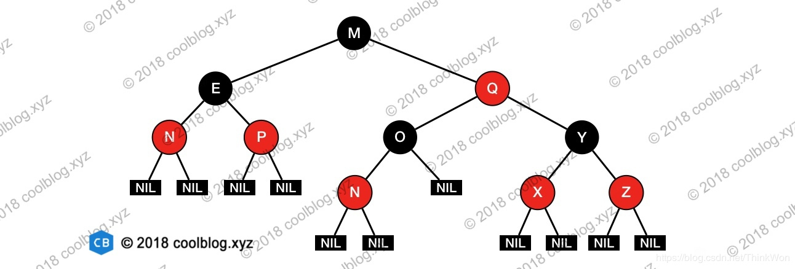

## 红黑树的性质

普通的二叉查找树在极端情况下可退化成链表，此时的增删查效率都会比较低下。为了避免这种情况，就出现了一些自平衡的查找树，比如 AVL，红黑树等。这些自平衡的查找树通过定义一些性质，将任意节点的左右子树高度差控制在规定范围内，以达到平衡状态。以红黑树为例，红黑树通过如下的性质定义实现自平衡：

1.  节点是红色或黑色。
2.  根是黑色。
3.  所有叶子都是黑色（叶子是NIL节点）。
4.  每个红色节点必须有两个黑色的子节点。（从每个叶子到根的所有路径上不能有两个连续的红色节点。）
5.  从任一节点到其每个叶子的所有简单路径都包含相同数目的黑色节点（简称黑高）。

有了上面的几个性质作为限制，即可避免二叉查找树退化成单链表的情况。但是，仅仅避免这种情况还不够，这里还要考虑某个节点到其每个叶子节点路径长度的问题。如果某些路径长度过长，那么，在对这些路径上的及诶单进行增删查操作时，效率也会大大降低。这个时候性质4和性质5用途就凸显了，有了这两个性质作为约束，即可保证**任意节点到其每个叶子节点路径最长不会超过最短路径的2倍**。原因如下：

当某条路径最短时，这条路径必然都是由黑色节点构成。当某条路径长度最长时，这条路径必然是由红色和黑色节点相间构成（性质4限定了不能出现两个连续的红色节点）。而性质5又限定了从任一节点到其每个叶子节点的所有路径必须包含相同数量的黑色节点。此时，在路径最长的情况下，路径上红色节点数量 = 黑色节点数量。该路径长度为两倍黑色节点数量，也就是最短路径长度的2倍。