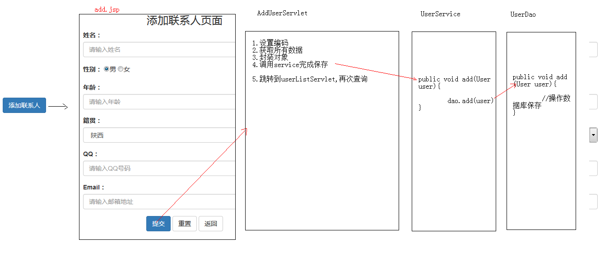
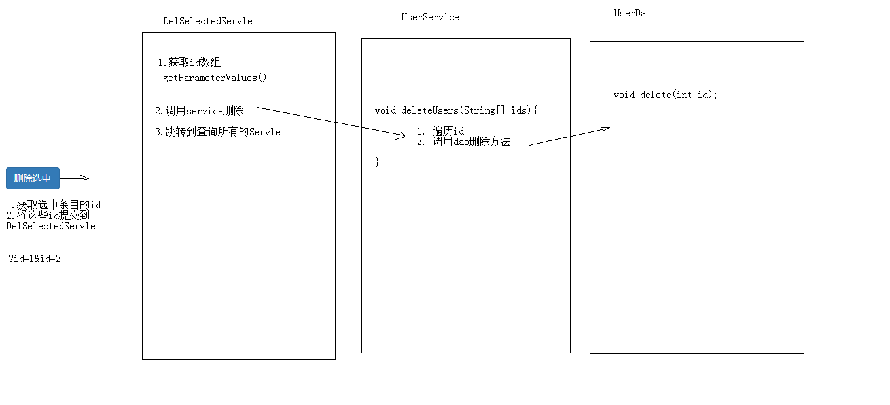
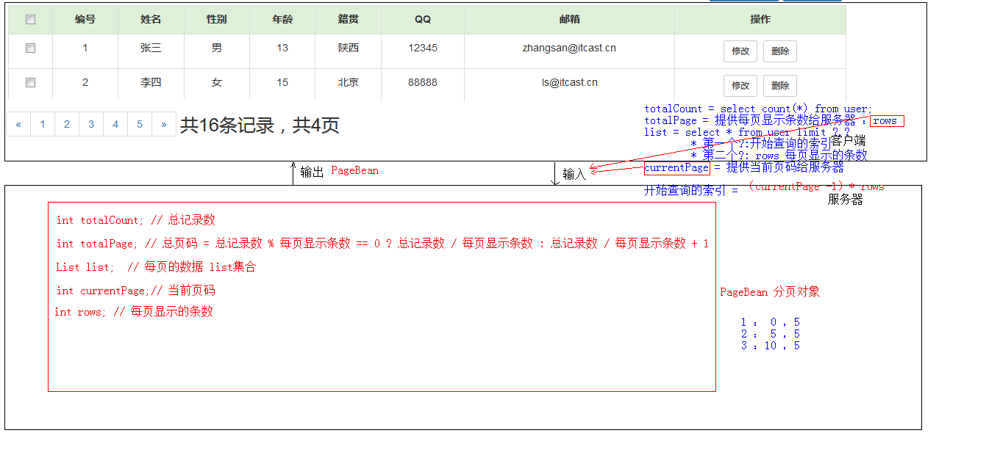
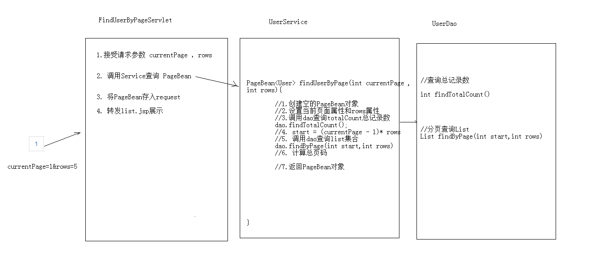
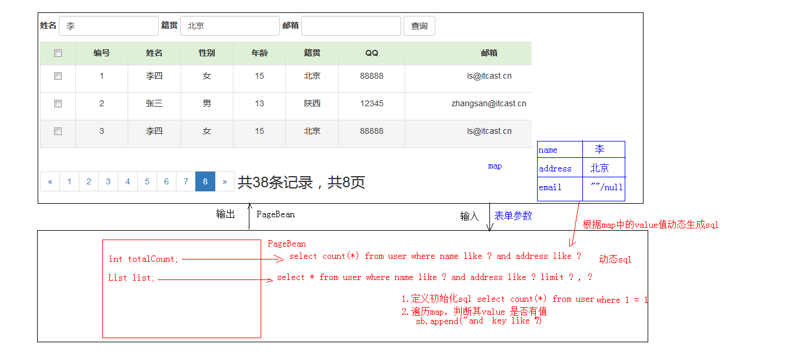

## 用户信息管理系统

### 一、需求分析

用户信息的增删改查操作

### 二、设计

#### 架构设计

#### 技术选型

控制器：Servlet

前端UI展示：JSP+Jquery

数据库：MySQL+JDBCTempleat+Duird连接池

封装数据：BeanUtils

服务器：Tomcat

### 三、功能分析

#### 添加功能

#### 删除功能

#### 删除选中功能

#### 修改功能

#### 分页功能

#### 条件查询功能

